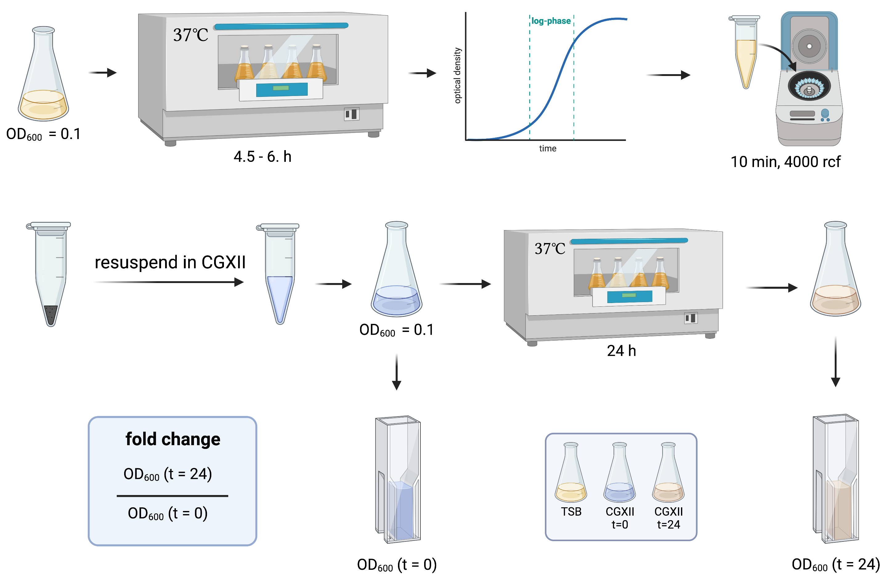

# Binary Growth Phenotypes

## Experimental Method
Growth in in high volume flasks for determination of binary phenotypes. High volumes of media (10 ml in 50 ml flasks) were inoculated to an optical density of 0.2 and the optical density after 0h and 24h was assessed to determine binary growth phenotypes (growths vs no growth). Binary phenotypes are used to access the accuracy of a GEM where simulation can be run f. ex. on different carbon sources and then these can be tested in the laboratory. The basis for comparison is usually M9 minimal medium which enables easy change of carbon source both in silico and in vitro.

## Folder structure
* `code` holds all scripts for data exploration and analysis
* `data` holds raw and aggregated laboratory data
* `figures` holds graphs and tables created with the scripts and the data provided in the other folders
* `metadata` holds experimental protocols, such as media formulation and a mapping for short versions of media formulations with different additives