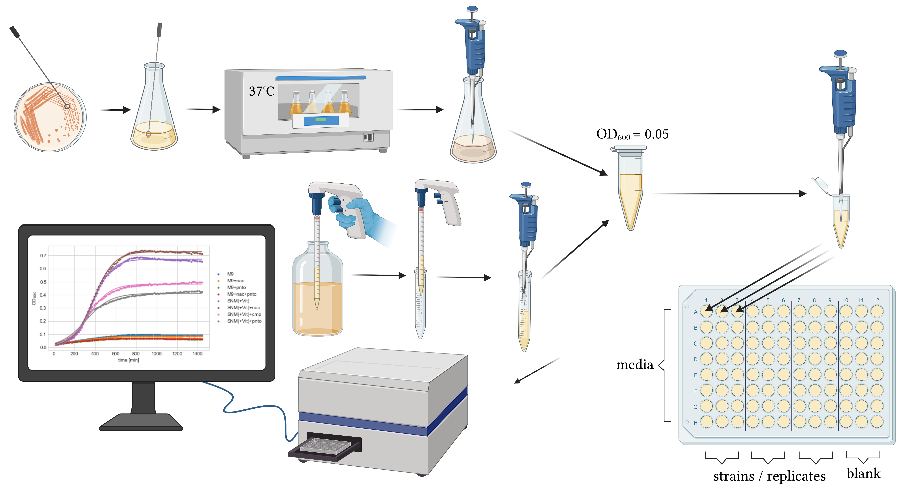

# Growth Kinetics

## Experimental method
Microtiter format to assess growth kinetics. Apart of binary phenotypes, prediction of metabolites or additional nutrients that increase/decrease growth rates are of high relevance for the planning of in vitro experiments. We used 150µl volume of media in a 96-well plate and automated, assessment of ODs over time to assess growth kinetics. From growth curves obtained in a plate reader we can use a fitting routine to extract the doubling time at the inflection point of the sigmoidal curve. This doubling time can then be compared to the predicted doubling times derived from the in silico growth rates.

## Folder structure
* `code` holds all scripts for data exploration and analysis
* `data` holds raw, averaged and aggregated laboratory data
* `figures` holds graphs and tables created with the scripts and the data provided in the other folders
* `metadata` holds experimental protocols and a the plate layout (where which samples was located)
* `amiga` holds tests of analysis with the Python package [AMiGA](https://github.com/firasmidani/amiga )

## Growth Curve Fitting comparison

* AMiGA  
    * https://github.com/firasmidani/amiga 
    * https://journals.asm.org/doi/10.1128/mSystems.00508-21 
    * BIOLOG plates 
    * https://firasmidani.github.io/amiga/ 
    * Python
    * Gaussian Process regression
* Growthcurver
    * https://github.com/sprouffske/growthcurver
    * https://bmcbioinformatics.biomedcentral.com/articles/10.1186/s12859-016-1016-7 
    * plate reader data 
    * https://cran.r-project.org/web/packages/growthcurver/vignettes/Growthcurver-vignette.html 
    * R 
    * fits growth curve data to a standard form of the logistic equation common in ecology and evolution whose parameters (the growth rate, the initial population size, and the carrying capacity) |
* https://journals.plos.org/plosone/article?id=10.1371/journal.pone.0245205 
    * method based on the time derivatives of the optical density 
* GroFit
    * not available anymore
    * https://www.nature.com/articles/npre.2010.4508.1 
    * determine characteristic growth parameters
    * "Model-based fits (1. Logistic growth, 2. Gompertz growth, 3. modified Gompertz growth and 4. Richards growth) and model-free spline fits"   |
